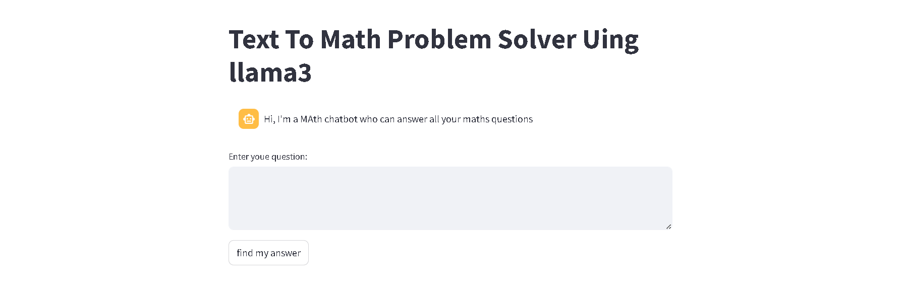
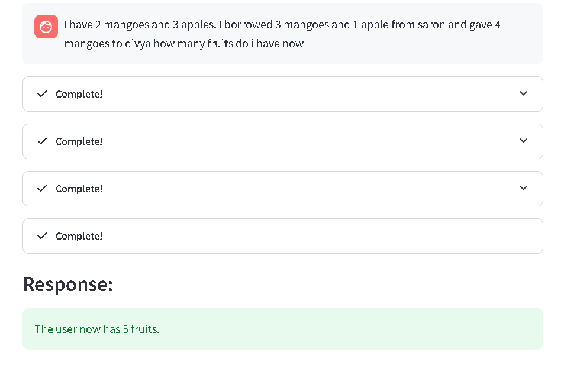
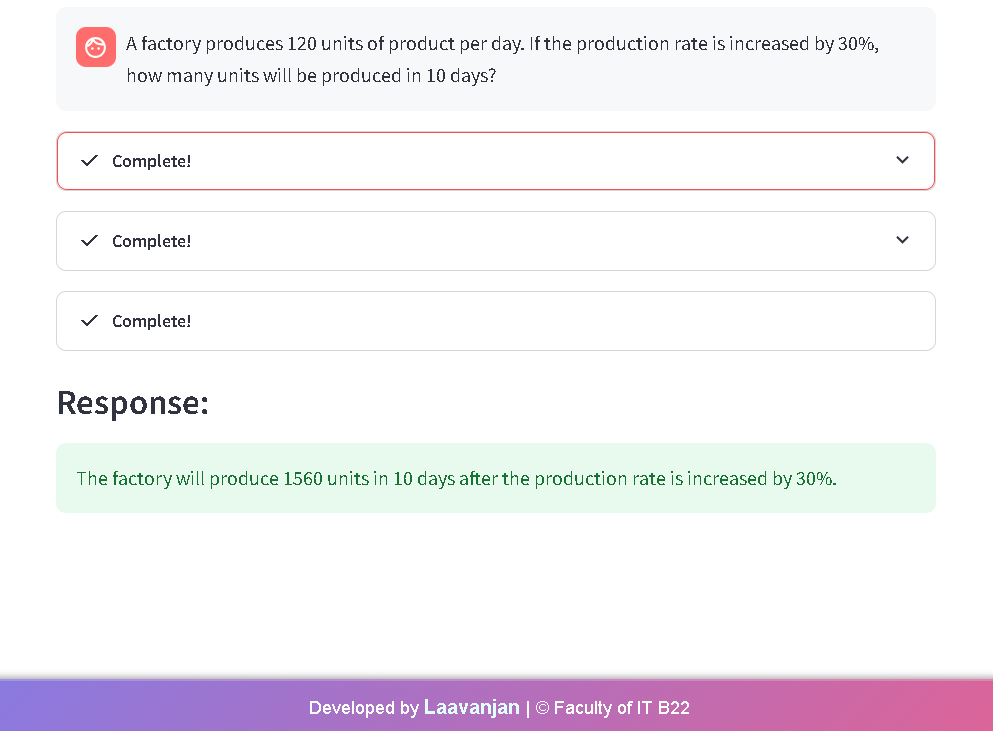
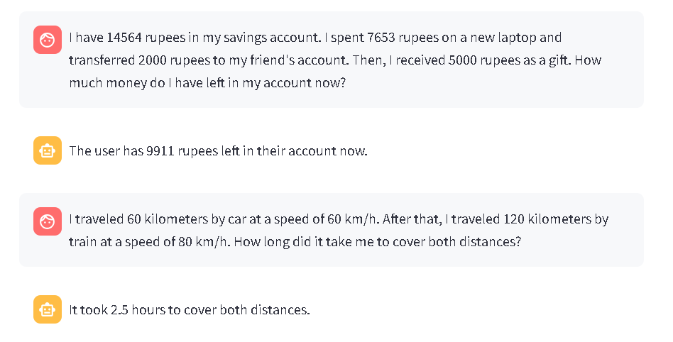
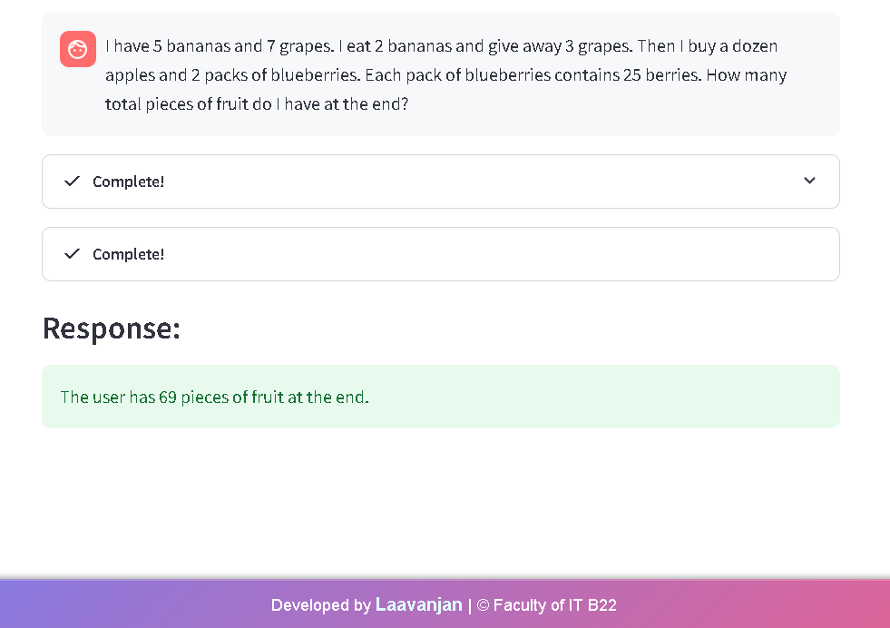
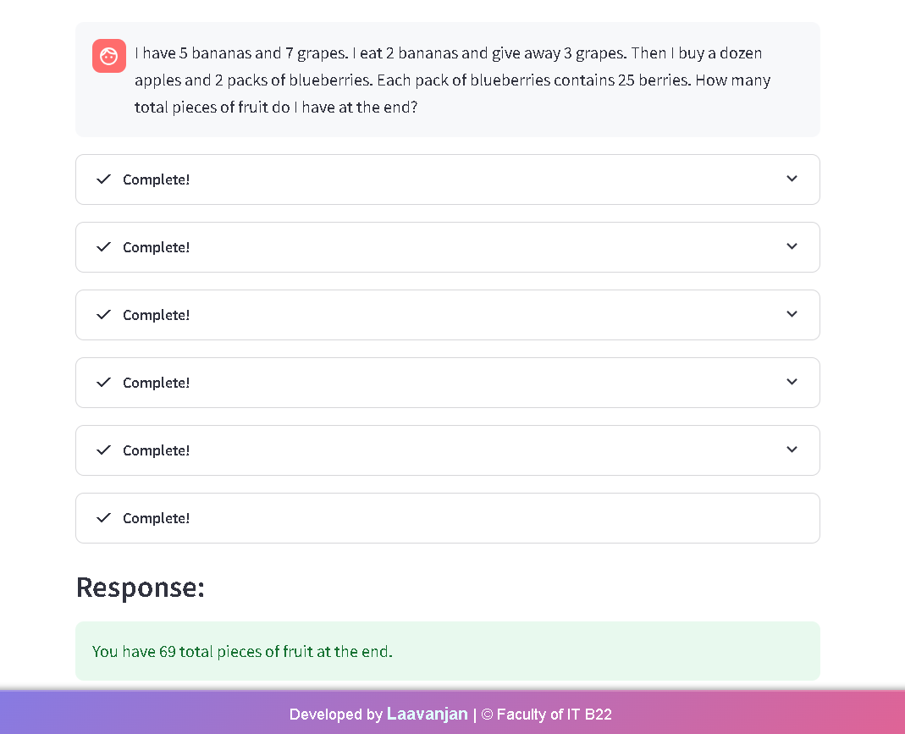
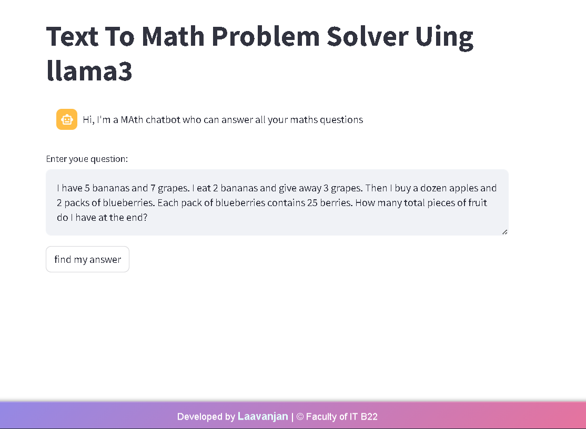

# Simple-Math-Problem-Solver-Bot

[](https://www.gnu.org/licenses/gpl-3.0)
[](https://www.python.org/downloads/release/python-390/)
[](https://streamlit.io/)
[](https://langchain.readthedocs.io/en/latest/index.html)
[](https://smith.langchain.com/)

This repository contains a Streamlit-based chatbot designed to solve basic mathematical problems presented in natural language. It leverages the power of LangChain,  Llama 3 LLM, and various tools (including a calculator and Wikipedia lookup) to provide accurate solutions and detailed explanations.  This project is licensed under the GPL v3 license.

## Table of Contents

- [Introduction](#introduction)
- [Features](#features)
- [Demo Pictures](#demo-pictures)
- [Installation](#installation)
- [Usage](#usage)
- [Architecture](#architecture)
- [Environment Variables](#environment-variables)
- [Contributing](#contributing)
- [License](#license)

## Introduction

The Simple-Math-Problem-Solver-Bot aims to bridge the gap between natural language and mathematical problem-solving. Users can input math problems in plain English, and the bot will process the request, utilize relevant tools, and return the answer along with a step-by-step explanation. This project demonstrates the potential of combining large language models with specialized tools for complex tasks.

## Features

- **Natural Language Input:** Users can express math problems in a conversational manner.
- **Math Problem Solving:** Accurately solves a variety of math problems, from basic arithmetic to more complex word problems.
- **Detailed Explanations:** Provides step-by-step reasoning for each solution.
- **Wikipedia Integration:** Leverages Wikipedia for retrieving relevant information related to the problem.
- **Streamlit Interface:** Offers a user-friendly web interface for interaction.
- **Llama 3 LLM:** Powered by Llama 3 large language model.
- **LangChain Framework:** Utilizes LangChain for managing LLMs, tools, and agents.
- **LangSmith Tracing:** Integrated with LangSmith for detailed tracking, debugging, and evaluation.
- **Conversation History:** Maintains a conversation history for context awareness.
- **Responsive Design:** The Streamlit app is designed to be responsive across different devices.

## Demo pictures
|  |  |
|----------------------|----------------------|
| Image 1              | Image 2              |

|  |  |
|----------------------|----------------------|
| Image 3              | Image 4              |

|  |  |
|----------------------|----------------------|
| Image 5              | Image 6              |

|  |                      |
|----------------------|----------------------|
| Image 7              |                      |
            |

## Installation

1. **Clone the repository:**

```bash
git clone [https://github.com/laavanjan/Simple-Math-Problem-Solver-Bot.git](https://github.com/laavanjan/Simple-Math-Problem-Solver-Bot.git)
cd Simple-Math-Problem-Solver-Bot
````

2.  **Create a virtual environment (recommended):**

<!-- end list -->

```bash
codna create -p venv
source venv/bin/activate  # On Windows: venv\Scripts\activate
```

3.  **Install the required packages:**

<!-- end list -->

```bash
pip install -r requirements.txt
```

4.  **Create a `.env` file in the root directory and add your API keys (see Environment Variables section).**

## Usage

1.  **Run the Streamlit app:**

<!-- end list -->

```bash
streamlit run app.py
```

2.  **Open the app in your web browser (usually at `http://localhost:8501`).**

3.  **Enter your math problem in the text area.**

4.  **Click the "find my answer" button.**

5.  **The bot will process your request and display the solution with a detailed explanation.**

## Architecture

The application employs a LangChain agent with a `ZERO_SHOT_REACT_DESCRIPTION` approach. It uses the Llama 3 LLM  and integrates tools like a calculator (via `LLMMathChain`) and Wikipedia.  The `reasoning_tool` uses a custom prompt template and `LLMChain` to provide logical explanations. The Streamlit interface manages user interaction and displays the bot's responses. LangSmith is used for tracing and monitoring the application's performance.

## Environment Variables

The following environment variables are required:

  - `API_KEY`: Your API key.
  - `LANGCHAIN_API_KEY`: Your LangChain API key (for LangSmith).
  - `LANGCHAIN_PROJECT`: The name of your LangSmith project.

Create a `.env` file in the root directory of your project and add these variables like this:

```
API_KEY=your_api_key
LANGCHAIN_API_KEY=your_langchain_api_key
LANGCHAIN_PROJECT=your_langsmith_project_name
```

## Contributing

Contributions are welcome\!  Please open an issue or submit a pull request.  For major changes, please discuss them first.

## License

This project is licensed under the terms of the [GNU General Public License v3.0](https://www.google.com/url?sa=E&source=gmail&q=https://www.gnu.org/licenses/gpl-3.0).

`
